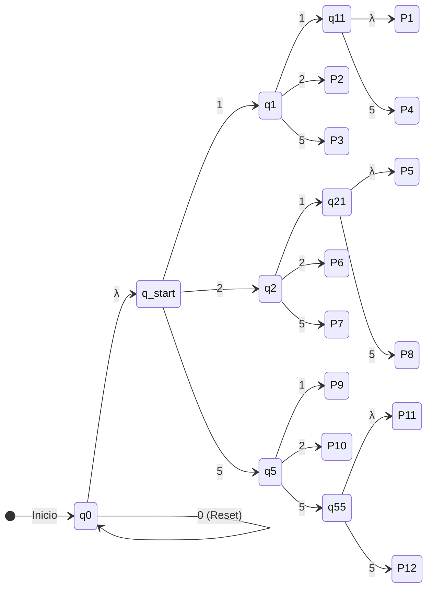

# Proyecto: Máquina Expendedora AFND (12 Productos)

Este documento detalla la estructura formal de un Autómata Finito No Determinista (AFND) diseñado para simular el comportamiento de una máquina expendedora con 12 _slots_ de productos. El sistema procesa cadenas de monedas, permitiendo combinaciones de precios con secuencias compartidas.

  

## 1. Definición Formal (Los 5 Parámetros)

El autómata se define matemáticamente mediante la quíntupla $\mathcal{M} = (Q, \Sigma, \delta, q_0, F)$:

  

### 1. Conjunto de Estados ($Q$)

Contiene los nodos de control, distribución y los 12 _slots_ físicos finales.

  

$$Q = \{q_0, q_{start}, q_1, q_2, q_5, q_{11}, q_{21}, q_{55}, P_1, P_2, P_3, P_4, P_5, P_6, P_7, P_8, P_9, P_{10}, P_{11}, P_{12}\}$$

### 2. Alfabeto ($\Sigma$)

Los símbolos válidos que el sistema puede procesar.

  

$$\Sigma = \{0, 1, 2, 5\}$$

_(Donde 1, 2 y 5 representan las denominaciones de dinero, y 0 funciona como un botón de reinicio o reposo)._

0 = Boton de Inicio
5 = 500
1 = 1000
2 = 2000
  
### 3. Estado Inicial ($q_0$)

$$q_0$$

### 4. Estados de Aceptación ($F$)

Los 12 _slots_ dispensadores de la máquina.

  

$$F = \{P_1, P_2, P_3, P_4, P_5, P_6, P_7, P_8, P_9, P_{10}, P_{11}, P_{12}\}$$

### 5. Función de Transición ($\delta$)

Al ser un AFND, incluye transiciones vacías ($\lambda$) y mapea las rutas hacia cada producto:

  

- **Inicio y Reposo:**
    
      
    - $\delta(q_0, 0) = \{q_0\}$ _(Bucle de reset)_
        
          
        
    - $\delta(q_0, \lambda) = \{q_{start}\}$ _(Salto para evaluación)_
        
          
        
- **División de Primer Nivel:**
    
      
    - $\delta(q_{start}, 1) = \{q_1\}$
        
          
        
    - $\delta(q_{start}, 2) = \{q_2\}$
        
          
        
    - $\delta(q_{start}, 5) = \{q_5\}$
        
          
        
- **Desglose Rama '1':**
    
      
    - $\delta(q_1, 1) = \{q_{11}\}$ $\rightarrow$ $\delta(q_{11}, \lambda) = \{P_1\}$ y $\delta(q_{11}, 5) = \{P_4\}$
        
          
        
    - $\delta(q_1, 2) = \{P_2\}$
        
          
        
    - $\delta(q_1, 5) = \{P_3\}$
        
          
        
- **Desglose Rama '2':**
    
      
    - $\delta(q_2, 1) = \{q_{21}\}$ $\rightarrow$ $\delta(q_{21}, \lambda) = \{P_5\}$ y $\delta(q_{21}, 5) = \{P_8\}$
        
          
        
    - $\delta(q_2, 2) = \{P_6\}$
        
          
        
    - $\delta(q_2, 5) = \{P_7\}$
        
          
        
- **Desglose Rama '5':**
    
      
    - $\delta(q_5, 1) = \{P_9\}$
        
          
        
    - $\delta(q_5, 2) = \{P_{10}\}$
        
          
        
    - $\delta(q_5, 5) = \{q_{55}\}$ $\rightarrow$ $\delta(q_{55}, \lambda) = \{P_{11}\}$ y $\delta(q_{55}, 5) = \{P_{12}\}$
        
          
        

## 2. Grafo del Autómata

Fragmento de código

## 3. Gramática y Expresión Regular

La Expresión Regular (ER) consolida todas las rutas válidas que la máquina acepta, evidenciando las 5 reglas gramaticales fundamentales de los autómatas.

  

$$ER = 0^* \lambda ( 11\lambda \mid 12 \mid 15 \mid 115 \mid 21\lambda \mid 22 \mid 25 \mid 215 \mid 51 \mid 52 \mid 55\lambda \mid 555 )$$

**Aplicación de las 5 Reglas:**

  

1. **Transición Simple:** El avance entre nodos consumiendo un solo símbolo del alfabeto, como procesar `1` para pasar de $q_{start}$ a $q_1$.
    
      
    
2. **Secuencia (Concatenación):** El encadenamiento de símbolos obligatorios para alcanzar un producto específico (ej. la secuencia `115` para llegar a P4).
    
      
    
3. **Bifurcación ( $\mid$ ):** Representa los múltiples caminos válidos (No Determinismo/Alternativa). El autómata bifurca su decisión evaluando si el usuario ingresa la secuencia de P2 **o** la secuencia de P3.
    
      
    
4. **Recursividad (Cierre de Kleene $0^*$):** Permite la repetición del símbolo `0` cero, una o infinitas veces sobre el estado inicial sin invalidar el proceso.
    
      
    
5. **Transición Vacía ($\lambda$ / $\epsilon$):** Cumple dos funciones vitales en este diseño. Primero, traslada pasivamente el sistema desde el reposo hacia la zona de evaluación ($q_{start}$). Segundo, permite aceptar secuencias cortas (como `11` para P1) sin exigir más símbolos, a la vez que mantiene viva la rama para secuencias largas (como `115` para P4).
