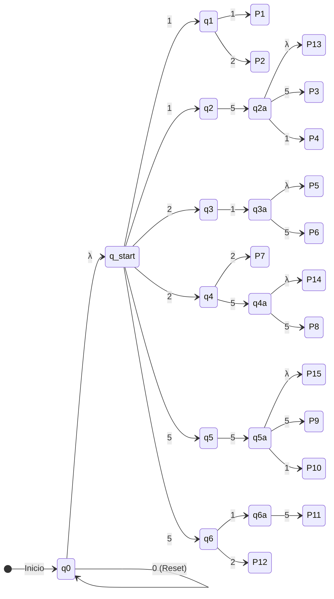

# AFND — Máquina Expendedora de 15 Slots (Versión Final)

Este documento contiene la especificación formal de un **Autómata Finito No Determinista (AFND)** diseñado para validar cadenas de monedas ingresadas a una máquina expendedora con 12 a 15 _slots_ físicos ($P_1 \dots P_{15}$).

Las cadenas aceptadas corresponden a secuencias únicas de dinero que activan un resorte específico. La asignación de los productos a los slots ocurre de manera aleatoria en la capa de infraestructura al iniciar el software.

## 1. Definición Formal (Los 5 Parámetros)

El autómata se define mediante la quíntupla $\mathcal{M} = (Q, \Sigma, \delta, q_0, F)$:

### 1. Conjunto Finito de Estados ($Q$)

$$Q = \{q_0, q_{start}, q_1, q_2, q_3, q_4, q_5, q_6, q_{2a}, q_{3a}, q_{4a}, q_{5a}, q_{6a}, P_1, P_2, P_3, P_4, P_5, P_6, P_7, P_8, P_9, P_{10}, P_{11}, P_{12}, P_{13}, P_{14}, P_{15}\}$$

- **$q_0$:** Estado de reposo / reinicio.

- **$q_{start}$:** Nodo divisor tras la transición vacía inicial.

- **$q_1 \dots q_6$ y $q_{2a} \dots q_{6a}$:** Nodos de control intermedio para evaluar secuencias.

- **$P_1 \dots P_{15}$:** Estados finales correspondientes a los 15 slots mecadores de la máquina.

### 2. Alfabeto ($\Sigma$)

$$\Sigma = \{0, 1, 2, 5\}$$

|**Símbolo**|**Valor Representado**|**Descripción**|
|---|---|---|
|`0`|Botón de Inicio / Reset|Permite despertar o reiniciar la pantalla sin consumir saldo.|
|`1`|Moneda de $1.000|Inicia o continúa secuencias de pago.|
|`2`|Moneda de $2.000|Inicia o continúa secuencias de pago.|
|`5`|Moneda de $500|Inicia o continúa secuencias de pago.|

### 3. Estado Inicial ($q_0$)

$$q_0$$

### 4. Conjunto de Estados de Aceptación ($F$)

$$F = \{P_1, P_2, P_3, P_4, P_5, P_6, P_7, P_8, P_9, P_{10}, P_{11}, P_{12}, P_{13}, P_{14}, P_{15}\}$$

### 5. Función de Transición No Determinista ($\delta$)

A diferencia de un autómata determinista, la función $\delta: Q \times (\Sigma \cup \{\lambda\}) \to \mathcal{P}(Q)$ retorna un **conjunto de estados**, permitiendo la evaluación paralela de múltiples caminos:

- **Reposo, Bucle y Transición Vacía Inicial:**

    - $\delta(q_0, 0) = \{q_0\}$ _(Bucle del botón reset)_
        
          
        
    - $\delta(q_0, \lambda) = \{q_{start}\}$ _(Salto espontáneo a zona de evaluación)_

- **No Determinismo Explícito (Nivel 1 — Ramificación por Símbolo):**

    - $\delta(q_{start}, 1) = \{q_1, q_2\}$ _(Al ingresar '1', explora simultáneamente $q_1$ y $q_2$)_
        
          
        
    - $\delta(q_{start}, 2) = \{q_3, q_4\}$ _(Al ingresar '2', explora simultáneamente $q_3$ y $q_4$)_
        
          
        
    - $\delta(q_{start}, 5) = \{q_5, q_6\}$ _(Al ingresar '5', explora simultáneamente $q_5$ y $q_6$)_

- **Ramas que Inician con '1' ($q_1, q_2$):**

    - $\delta(q_1, 1) = \{P_1\}$
        
          
        
    - $\delta(q_1, 2) = \{P_2\}$
        
          
        
    - $\delta(q_2, 5) = \{q_{2a}\}$
        
          
        
    - $\delta(q_{2a}, \lambda) = \{P_{13}\}$ _(Aceptación temprana vía $\lambda$ para la secuencia '15')_
        
          
        
    - $\delta(q_{2a}, 5) = \{P_3\}$
        
          
        
    - $\delta(q_{2a}, 1) = \{P_4\}$

- **Ramas que Inician con '2' ($q_3, q_4$):**

    - $\delta(q_3, 1) = \{q_{3a}\}$
        
          
        
    - $\delta(q_{3a}, \lambda) = \{P_5\}$ _(Aceptación temprana vía $\lambda$ para la secuencia '21')_
        
          
        
    - $\delta(q_{3a}, 5) = \{P_6\}$
        
          
        
    - $\delta(q_4, 2) = \{P_7\}$
        
          
        
    - $\delta(q_4, 5) = \{q_{4a}\}$
        
          
        
    - $\delta(q_{4a}, \lambda) = \{P_{14}\}$ _(Aceptación temprana vía $\lambda$ para la secuencia '25')_
        
          
        
    - $\delta(q_{4a}, 5) = \{P_8\}$

- **Ramas que Inician con '5' ($q_5, q_6$):**

    - $\delta(q_5, 5) = \{q_{5a}\}$
        
          
        
    - $\delta(q_{5a}, \lambda) = \{P_{15}\}$ _(Aceptación temprana vía $\lambda$ para la secuencia '55')_
        
          
        
    - $\delta(q_{5a}, 5) = \{P_9\}$
        
          
        
    - $\delta(q_{5a}, 1) = \{P_{10}\}$
        
          
        
    - $\delta(q_6, 1) = \{q_{6a}\} \to \delta(q_{6a}, 5) = \{P_{11}\}$
        
          
        
    - $\delta(q_6, 2) = \{P_{12}\}$

## 2. Tabla de Mapeo Único de Slots (15 Cadenas)

|**Slot Final**|**Cadena Exacta de Monedas**|**Valor Sumado**|**Función de Transición Vacía (λ)**|
|---|---|---|---|
|**$P_1$**|`11`|$2.000|No requiere.|
|**$P_2$**|`12`|$3.000|No requiere.|
|**$P_{13}$**|**`15`**|$1.500|**Sí** ($q_{2a} \xrightarrow{\lambda} P_{13}$): Permite aceptar '15' sin pedir más símbolos.|
|**$P_3$**|`155`|$2.000|No requiere (Sigue desde $q_{2a}$ consumiendo '5').|
|**$P_4$**|`151`|$2.500|No requiere (Sigue desde $q_{2a}$ consumiendo '1').|
|**$P_5$**|**`21`**|$3.000|**Sí** ($q_{3a} \xrightarrow{\lambda} P_5$): Acepta '21' directamente.|
|**$P_6$**|`215`|$3.500|No requiere (Sigue desde $q_{3a}$ consumiendo '5').|
|**$P_7$**|`22`|$4.000|No requiere.|
|**$P_{14}$**|**`25`**|$2.500|**Sí** ($q_{4a} \xrightarrow{\lambda} P_{14}$): Acepta '25' directamente.|
|**$P_8$**|`255`|$3.000|No requiere (Sigue desde $q_{4a}$ consumiendo '5').|
|**$P_{15}$**|**`55`**|$1.000|**Sí** ($q_{5a} \xrightarrow{\lambda} P_{15}$): Acepta '55' directamente.|
|**$P_9$**|`555`|$1.500|No requiere (Sigue desde $q_{5a}$ consumiendo '5').|
|**$P_{10}$**|`551`|$2.000|No requiere (Sigue desde $q_{5a}$ consumiendo '1').|
|**$P_{11}$**|`515`|$2.000|No requiere.|
|**$P_{12}$**|`52`|$2.500|No requiere.|

## 3. Grafo del Autómata (Mermaid Diagram)

Fragmento de código

## 4. Gramática y Expresión Regular

La Expresión Regular ($ER$) que genera el lenguaje formal aceptado por la máquina expendedora es:

$$ER = 0^* \lambda ( 11 \mid 12 \mid 15\lambda \mid 155 \mid 151 \mid 21\lambda \mid 215 \mid 22 \mid 25\lambda \mid 255 \mid 52 \mid 515 \mid 55\lambda \mid 555 \mid 551 )$$

### Desglose de las 5 Reglas Gramaticales

1. **Transición Simple:** Transiciones unitarias al consumir un símbolo del alfabeto (ej. $q_{start} \xrightarrow{1} q_1$).

2. **Secuencia / Concatenación:** Encadenamiento de símbolos para formar una ruta única (ej. `155` o `515`).

3. **Bifurcación u Operador de Alternativa ($\mid$):** La base teórica del AFND. Un mismo estado o entrada permite tomar caminos distintos (ej. desde $q_{start}$ con el símbolo `1` el autómata evalúa las ramas hacia $q_1$ **O** hacia $q_2$).

4. **Recursividad / Cierre de Kleene ($0^*$):** Bucle sobre $q_0$ que permite presionar el botón `0` de forma opcional (0, 1 o infinitas veces) antes de ingresar dinero.

5. **Transición Vacía ($\lambda$ o $\epsilon$):** Cumple dos funciones clave en el modelo:

**Salto de Reposo:** Pasa de $q_0$ a $q_{start}$ sin consumir caracteres.
        
          
        
**Aceptación Temprana de Secuencias Cortas:** Permite que secuencias como `15` lleguen a $P_{13}$ mediante $\lambda$, mientras que al ingresar un carácter adicional (`155` o `151`) esa rama $\lambda$ es descartada y la evaluación continúa hacia $P_3$ o $P_4$.